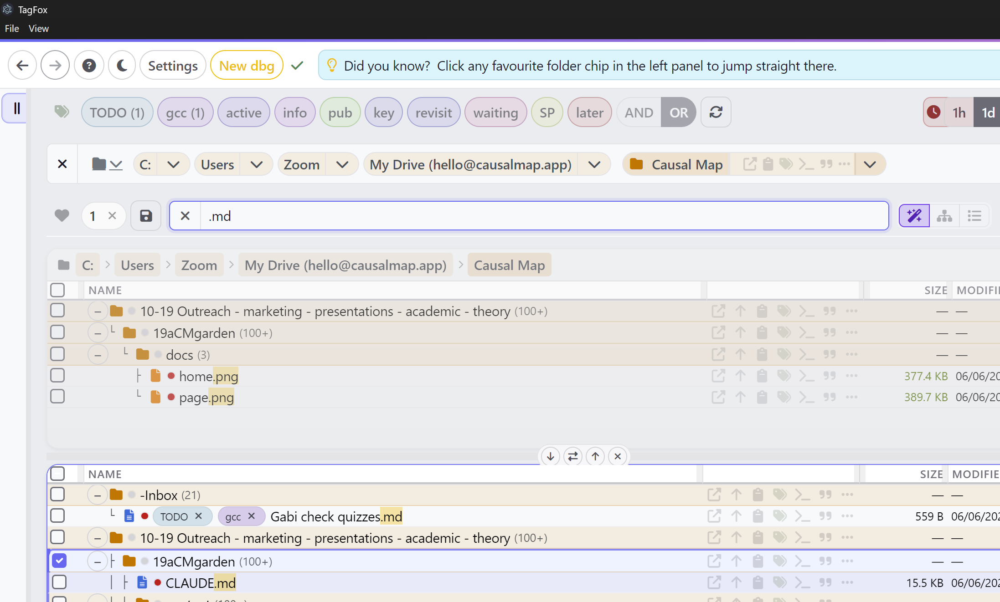

# TagFox

TagFox is a fast, keyboard-friendly file finder and tagger for Windows. It puts instant search, a folder tree, file previews and filename tags in one window, so you can find, preview and organise your files without opening File Explorer.

It runs on top of [Voidtools Everything](https://www.voidtools.com/), which indexes your whole drive and answers searches the moment you type.



## For everyday users

### What you get

- **Instant search** across your whole drive as you type.
- **Tags** you add right in the filename, like `Report xkdraft xkurgent.docx`. Click a tag to filter; the tags travel with the file into Explorer, Google Drive and zip files because they are part of the name.
- **Previews** of images, PDFs, Word, Excel, PowerPoint, markdown, text, audio and video, in a side panel.
- **A folder tree** so you see results in context, not as a flat list.
- **Favourites and saved searches** you reach with one click or a number key.

### Install in three steps

TagFox needs Everything running in the background. Everything is free.

1. **Install Everything 1.5a** from the [Everything 1.5a downloads](https://www.voidtools.com/everything-1.5a), then add the HTTP Server plugin: [x64 installer](https://www.voidtools.com/Everything-HTTP-Server-1.0.3.4.x64-Setup.exe) or [x86 installer](https://www.voidtools.com/Everything-HTTP-Server-1.0.3.4.x86-Setup.exe). Let Everything finish its first index.
2. **Turn on the HTTP server** in Everything under **Tools, Options, HTTP Server**. Keep the default address `127.0.0.1` and port `8080`.
3. **Install TagFox.** Download the latest `TagFox Setup` installer from the [Releases page](https://github.com/stevepowell99/TagFox/releases) and run it. TagFox is not code-signed, so Windows SmartScreen may warn you the first time; choose **More info, Run anyway**.

Open TagFox. In **Settings**, under **Connection to Everything Search**, the URL should already be `http://127.0.0.1:8080`. If results stay empty, Everything is probably not running.

TagFox relies on the `sort-mix:` feature, so Everything 1.5a is the supported version. Everything 1.4 may connect but is not supported.

### First things to try

- **Set a search scope (recommended on a new PC).** In **Settings**, set one **search scope folder**, for example your profile or a projects root. Everything then only returns paths under that root.
- **Pick a current folder** from the breadcrumb. Search, paste and new files use the current folder.
- **Switch views** with the buttons by the search box: Flat, Tree or Smart layout, subfolders on or off, files and folders or folders only.
- **Tag a file.** Select a row, press `Ctrl`+`T`, and add a tag like `draft` or `2026`. The file is renamed on disk straight away.
- **Press `F1` or `Ctrl`+`/`** any time for the full in-app guide.

If search feels slow, open **Advanced** and turn off **Folder-contents highlight** and **Hide special**.

## Features

- **Keyboard first.** Navigate, tag, rename, bulk-edit and search without the mouse. Press `F1` for the shortcut table.
- **Filename tags.** Add, remove and filter by `xktag` labels stored in the filename. No database and no hidden metadata, so tags work everywhere the file goes.
- **Three view switches.** Flat or Tree, subfolders on or off, files and folders or folders only, combined freely. Recency buttons (1h, 1d, 1w, 1m, 1y) filter to what changed recently.
- **Fast previews.** Images, PDFs, Word, Excel, PowerPoint, text, JSON, markdown and more in the Viewer panel. For a folder it shows a folder readme you can edit in place.
- **Smart view.** The default layout adjusts which results you see relative to **Max results**, so you rarely touch the subfolder and file toggles by hand.
- **Favourite folders and saved searches.** Bookmark a folder or a whole search, reorder by drag, and jump back with `Ctrl`+`1` to `9` (searches) or `Ctrl`+`Shift`+`1` to `9` (folders). These are your persistent bookmarks; tabs (below) are for throwaway working views.
- **The Shelf.** A staging strip beside the results. Collect files from several folders, navigate elsewhere, then paste or drag them in. A clipboard for files that does not empty when you move.
- **Bulk rename.** Check several files, press `Ctrl`+`H`, and use wildcards on the last path segment with a live preview.
- **Add TODO.** Create a small markdown file tagged `xkTODO` in the current folder from the Viewer panel.
- **Folder docs.** The Viewer loads the first of `-readme.md`, `readme.md`, `claude.md`, `agents.md`, `about.md`, `index.md` and similar, so each folder can describe itself.
- **Result tabs.** Open throwaway scratch tabs above the results (the `+` button, up to 10), each holding its own search, scope and filters. Switch by clicking, `Ctrl`+`Tab` / `Ctrl`+`Shift`+`Tab`, or by dragging a file onto a tab to spring it open. Drag tabs to reorder; middle-click or the `×` to close. Tabs are kept for the session.
- **Paste from Explorer and screenshots.** Paste copied files into the current folder, or paste a screenshot to save `Clipboard image.png` there.
- **Mixed local and Google Docs.** Local Office files preview inline. Google Workspace shortcuts (`.gdoc`, `.gsheet`, `.gslides`) open in a popup, resolved from the shortcut or the Drive stream, including streamed (on-demand) files.
- **Google Drive shortcut folders.** Shared-folder shortcuts under `.shortcut-targets-by-id` are resolved to their real names in the breadcrumb and Name column, cached across restarts.
- **Open in gmist.** A markdown file (`.md`/`.qmd`) gets a row button for the [gmist](https://mist.broad-smoke-cc64.workers.dev) web editor, and you choose local or online per click. The pen icon opens the file in a local gmist straight from disk by its path (any file on any drive, in or out of Google Drive), in a TagFox window rather than the browser, starting `npm run dev:local` first if it is not already running, which takes about a minute the first time. The cloud icon opens the deployed editor in your browser using the file's Drive id (Google Drive files only). Both show on a Drive file. Online, auth is your signed-in gmist session; local gmist needs no sign-in.

## For developers

TagFox is an [Electron](https://www.electronjs.org/) desktop app. It talks only to the local Everything HTTP server and the local filesystem; there is no backend.

### Run from source

You still need Everything 1.5a with its HTTP server running (see the install steps above).

```bash
npm install
npm start
```

`npm start` runs `prestart`, which syncs vendor assets and rebuilds the help file before launching Electron.

### Build an installer

```bash
npm run dist
```

This runs electron-builder via `scripts/run-dist.js`. The installer is written **outside the repo** to `%LOCALAPPDATA%\TagFox-dist\` (not `dist/`, to avoid "app.asar in use" failures when an editor watches the tree), and the newest `.exe` is then copied to the shared Drive folder `Causal Map\` as `TagFox Setup <version>.exe`. That Drive copy is the distribution channel for colleagues. The build is not code-signed, so SmartScreen may warn recipients.

Release steps: bump `version` in `package.json`, run `npm run dist`, then delete any older `TagFox Setup *.exe` from the Drive folder so only the current one remains (stale copies are the main cause of "I installed it but it is the wrong version"). The running build's version shows in the **Help** modal header (stamped by `build-help.js` from `package.json`), so anyone can read off which build they have.

The build bundles `google-oauth-client.json` (it is in the `build.files` allowlist) so distributed installers get the Google features, not just local `npm start` runs. The file must therefore be present in the app root at build time. A desktop OAuth client secret is not truly confidential (Google treats desktop clients as unable to keep one; the protection is the user's own sign-in and consent), so shipping it inside the exe is acceptable. It stays gitignored, so it lives only on the build machine, back it up with the other project secrets.

### Tests

```bash
npm test
```

This runs the result-tabs and refresh regression suite. The tests launch the real app under the Chrome
DevTools Protocol and drive it through a hidden `#tagfoxtest` hook (inert in normal runs), so they exercise
the actual `renderer.js`. Everything must be running, the same as for the app. Full detail, including the
invariants checked and how to add a test, is in [`test/README.md`](test/README.md).

### Project layout

| File | Role |
|------|------|
| `main.js` | Electron main process: window, menus, IPC, filesystem and shell operations, Google OAuth |
| `preload.js` | Context bridge between renderer and main |
| `renderer.js` | The UI: search, results, tree, tags, Viewer, Shelf, favourites, keyboard handling |
| `index.html`, `styles.css` | Markup and styling (Bootstrap 5 plus custom CSS) |
| `tags.js` | Tag parsing and the `xktag1 xktag2` filename grammar |
| `preview-text-helpers.js` | Text and markdown preview helpers |
| `did-you-know-tips.js` | Rotating tips shown in the tip bar |
| `help.md`, `help.html` | In-app help source and generated output |
| `scripts/build-help.js` | Builds `help.html` from `help.md` and its tab markers |
| `scripts/sync-vendor-assets.js` | Copies Bootstrap, Font Awesome, CodeMirror and other vendor files into `vendor/` |
| `scripts/run-dist.js` | Wraps the electron-builder distribution build |
| `test/` | Automated dual-pane / refresh regression tests (see [`test/README.md`](test/README.md)) |

### How search works

Everything's HTTP API returns all folders before all files for a given sort. With **Max results** capped, a folder-heavy scope can fill a page with folders and show no files. Everything 1.5a adds a `sort-mix:` prefix that interleaves files and folders in true sort order, and TagFox appends it when **Hide files** is off (see `runSearch()` in `renderer.js`). This is why 1.5a is required. Reference: the [Everything forum thread](https://www.voidtools.com/forum/viewtopic.php?t=8994).

Active tag filters are sent to Everything as a regex clause, so matches exist before results load. The tag bar refresh control runs a full-index scan for `xk…` tag tokens and prunes tags that no longer appear; ordinary searches do not. **Hide special** and **Hide ~** are client-side filters in `filteredRows()`; the Everything query is unchanged, so paging still counts raw hits per page.

### Search concurrency and result tabs

The results area is a set of scratch tabs above one visible results pane. That single pane always owns the
canonical DOM ids (`tbody`, `resultsTable`, and so on), so `renderTable()` (which writes to `#tbody`) always
targets it. Each tab holds its own `searchState`, `lastRows` and paging context in the `tabs` array;
switching tabs saves the live UI into the leaving tab (`saveActiveTabStateFromUi`) and loads the entering
one (`restoreTabStateIntoUi`). Only the active tab has DOM: **inactive tabs are pure state snapshots** with
no rendered rows, re-searched when you activate them (`activateTab`).

This is why the results code is simple to reason about: there is never a second pane rendering in the
background. A search, F5, auto-refresh or CRUD refresh only ever touches the active tab. The old two-pane
split kept both panes rendered at once, and every historical bug (searches rendering into the hidden pane,
load-more rows lost on a background refresh, a copy/delete in one pane bleeding into the other) came from a
background flow re-rendering the *other* pane. Removing simultaneous rendering removed that whole bug class.

One search flow still runs at a time. `searchMutex` serialises top-level flows; truly nested calls
(smart narrow / probe re-searches fired synchronously inside an outer `runSearch`) skip the mutex by passing
`nested: true`. Nesting is marked explicitly: a fresh event-loop task (the debounced search, F5, a
disk-mutation retry) that fires while another flow is mid-await waits for the mutex rather than running
concurrently. Activating a tab re-runs its search through the same mutex, so it serialises behind any
in-flight search.

`loadMoreResults()` grows `lastRows` and must persist it to the active tab in its `finally`; otherwise a
later tab switch (which restores from stored state) reverts to the pre-load-more page. Guarded by
`loadmore-regression.cjs`; cross-tab CRUD isolation by `crud-pane-isolation.cjs`; the tab lifecycle by
`tab-lifecycle.cjs`.

### Refresh after CRUD (delete fast-path)

Every CRUD refresh acts on the active tab only; other tabs stay as they were until you switch to one, which
re-runs its search against disk. So a copy, move or delete in one tab never changes another, and there is no
stale-snapshot problem to surface: an inactive tab is always refreshed on activation.

A delete only removes rows. `removeGonePathsFromUiNow()` tombstones the deleted paths and repaints once, so
the rows vanish immediately. Because no new content can appear, `refreshAfterDiskMutation()` detects a pure
delete (`isPureTombstoneMutation`, payload `trashed` with no `destFolder`/`copied`/`moved`) and skips the
immediate re-query, scheduling a single quiet reconcile (~1s) to retire the tombstones once the Everything
index settles. Moves and pastes bring in new rows and keep the prompt refresh plus the 350ms/1200ms catch-up
retries. All delete call sites (bulk bar, Delete key, context menu) tag the payload with `trashed: true` so
the fast-path fires regardless of which refresh call wins the coalesce.

The recycle itself (`main.js`) was the bigger cost for cloud paths (Google Drive, OneDrive), which take the
PowerShell route because `shell.trashItem` rejects many of those paths. The old script spawned one PowerShell
per file and compiled C# at runtime each time (about 365ms of compile plus cold start, so 1-4s for a few
files). It now loads `Microsoft.VisualBasic` from the GAC (no compile) and recycles the whole batch in one
spawn, returning per-path results as JSON lines. Local paths still use the native `shell.trashItem` (no
spawn). Measured: 3 files about 4.0s to 1.7s, 5 files about 6.8s to 1.4s.

### Drag and drop

The default row and Shelf drag uses an in-page protocol (move or copy inside the app; hold `Shift` to copy). External apps need `Alt`+drag, or the Shelf **OS drag** arm, to receive native paths. Native drag blocks the UI thread, which is why the two paths are kept separate.

### Editing the help

The in-app help is generated from [`help.md`](help.md). Each tab is introduced by a single-line HTML comment whose body is `help:tab` plus JSON (`id`, `label`, one `"active":true`, optional `"format":"html"`). Edit `help.md`, then run:

```bash
npm run build:help
```

`npm start` and `npm run dist` rebuild the help for you. Notes for maintainers only live in the HTML comment at the top of `help.md`.

### Google Drive setup (optional)

**Create new Google Doc here** needs a single Google OAuth client. Add `google-oauth-client.json` in the app root with either:

- `{ "clientId": "...", "clientSecret": "...", "redirectUri": "http://127.0.0.1:53682/oauth2callback" }`
- or standard Google Desktop JSON (`installed.client_id`, `installed.client_secret`, `installed.redirect_uris`).

In the [Google Cloud Console](https://console.cloud.google.com/), under OAuth consent screen and Credentials, include the scopes `drive.metadata.readonly` and `drive.file`. On first use TagFox opens browser sign-in once and saves a single account token in the app userData folder. If you carried over a token from an older build, delete `tagfox-google-oauth-token.json` in app userData and sign in again so `drive.file` is granted. After startup, a green tick in the status bar means the Drive API ping succeeded.

The `google-oauth-client.json` file holds client credentials and is gitignored. Do not commit it. It is, however, bundled into the packaged installer (see "Build an installer" above) so distributed builds get Google features.

Because it is gitignored it does not travel with a clone, so a fresh machine has no Google features at all and every Drive-backed action fails with "Google Drive sign-in is needed first" while opening nothing. The copy to use is `Causal Map\mild-secrets\client_secret.json` on the shared Drive (a desktop client in the standard `installed` shape); copy it to the app root as `google-oauth-client.json` and sign in once. `machine-parity.ps1` checks for it under `oauth-client`, so a machine missing it says so rather than waiting to be discovered mid-task.
